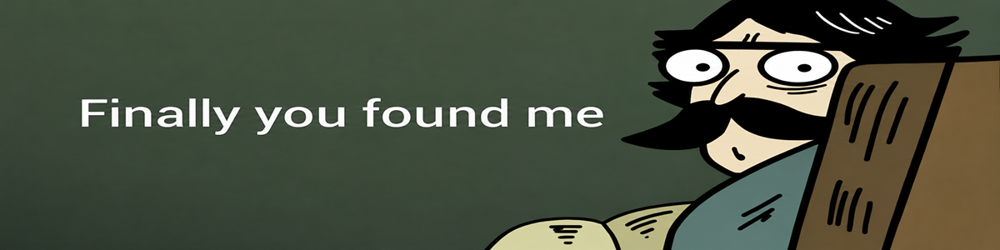

  

  <h1>Know About Me</h1>

  <h2 align="center">Hi, I'm Arash</h2>
  
<strong>Front-End Developer | React.js & Next.js</strong>

  
I build modern , scalable , and high-performance web applications with a strong focus on maintainable architecture , reusable components , responsive design , and exceptional user experiences.
Passionate about writing clean , efficient code and continuously exploring modern technologies and best practices across the web development ecosystem.

  <h3>Technologies & Tools</h3>
  

    
  

  <h3>Contact</h3

